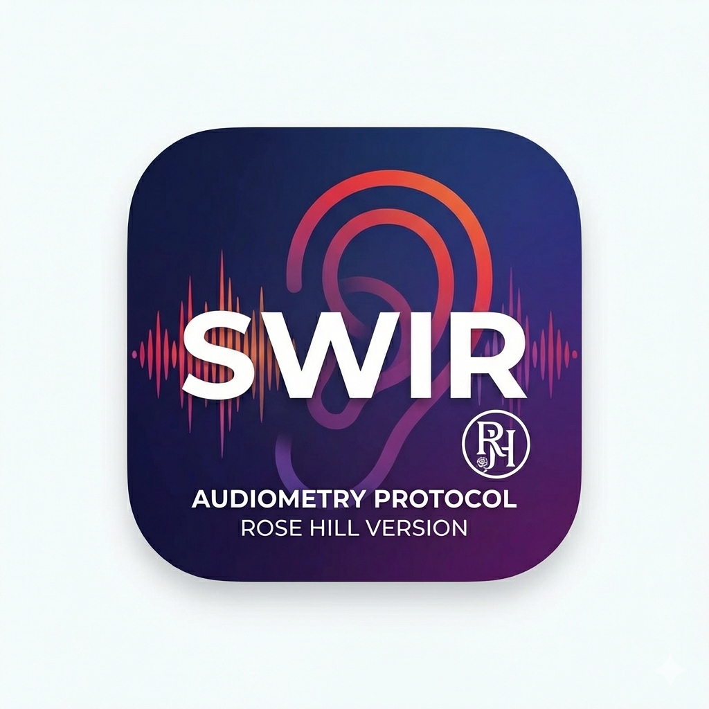

# SWIR Speech Audiometry Scoring System

A desktop application for administering and scoring Speech Audiometry tests (SWIR). Built with **Electron**, **React**, and **Webpack**.



## Features

- **Standardized Forms**: Includes Form A and Form B with 50 sentences each (2 blocks of 25).
- **Audio Playback**:
  - Integrated audio player with sentence-by-sentence playback.
  - **Stereo Control**: Route speech and noise to specific channels (Left/Right).
  - **Masking Noise**: Built-in multi-talker babble noise with independent SNR calibration.
  - **Calibration**: Play 1kHz calibration tones to verify output levels.
- **Practice Mode**: A dedicated mode ("Form Practice") for patient acclimatization (results excluded from clinical scoring).
- **Scoring & Reporting**:
  - Live identifying of target words.
  - Automated scoring (Correct/Incorrect).
  - **Real-time Visualization**: Combined grouped bar graphs comparing Form A vs. Form B performance.
  - **PDF Export**: Generate detailed clinical reports with patient data and performance graphs.
- **Cross-Platform**: Runs on Windows, macOS, and Linux.

## Installation & Development

### Prerequisites
- Node.js (v18 or higher recommended)
- NPM

### Setup
```bash
# Clone the repository
git clone https://github.com/your-org/swir-audiometry.git

# Install dependencies
cd swir-audiometry
npm install
```

### Running Locally
To start the React dev server and Electron wrapper simultaneously:
```bash
npm run dev
```
- The React app runs on `http://localhost:3001`.
- Electron window opens automatically.

## Audio Asset Structure
The application denies relying on strict file paths for audio playback. Ensure your `audio_output` directory is structured as follows:

```
swir_project/
├── audio_output/
│   ├── Form A/
│   │   └── wav/
│   │       ├── swir_01.wav
│   │       └── ...
│   ├── Form B/
│   │   └── wav/
│   │       ├── swir_26.wav
│   │       └── ...
│   └── Form Practice/
│       └── wav/
│           ├── swir_p01.wav
│           └── ... (up to swir_p05.wav)
```

## Building for Production

This project uses `electron-builder` to create installers for Windows (.exe), macOS (.dmg), and Linux (.AppImage/.deb).

```bash
# Build for current OS
npm run package
```

### GitHub Actions (CI/CD)
Automated builds are configured in `.github/workflows/build.yml`.
- **Push to `main`**: Triggers a test build.
- **Tag (`v*`)**: Triggers a build and creates a **GitHub Release** with attached artifacts.

## License
MIT License. See [LICENSE](LICENSE) for details.

## Author
Mark Shaver <mark.shaver@posteo.net>
